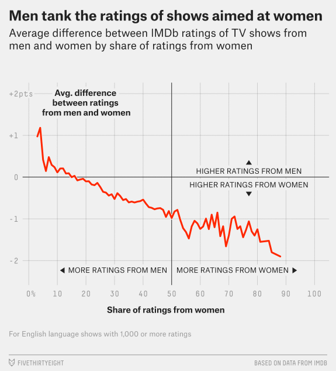

```{r setup, include=FALSE}
knitr::opts_chunk$set(echo = TRUE)
```

## Attacks on Recommender System 

Not surprisingly, a great product creating values to people often abused by a small groups of people to server their own purposes. Recommender system, an online tool offers recommendations to customers based on customers' review, was widely used in movie recommendations, and is often violated by people who tried to manipulate the system with their points of views, and influence the others' movie selections.  

One of the examples is that the movie 'The Promise' was rated 12k times before the movie hits theatre according to the subject of the movie, and another example is that the female-led 'Ghostbusters' reboot received poor reviews because of gender. Some analyses have been conducted on the review by gender. There are also other reasons that cause rating system can't reflect fair judgments purely on the quality of the movie.



## How to Pretect Fairness of Recommender System

How to protect the fairness of recommendation system and guidance customers with opinions that represents the viewers as a whole? There are a few things we can do:

1.	Knowing who review the movies. Categorize reviewers, break down the reviewers by gender, age, and nationality etc.;
2.	Provide analysis on review contents. What are the top good words and bad words on the movie reviews, and what top words associated with different level of ratings.

Only the data will tell perfect stories behind the reviews, and truly present the opinions of each reviewer. A reviewer profile is an important factor to understand why a reviewer create the review, and it also helps to predict the future reviews; and the transparency of the review contents also bring a clear picture of the reviews to customers.

## Reference:

https://www.washingtonpost.com/news/morning-mix/wp/2017/04/19/wisdom-of-the-crowd-imdb-users-gang-up-on-the-promise-before-it-even-opens/?utm_term=.329a75ece088

http://time.com/4748833/the-promise-armenia-1915-history/

https://fivethirtyeight.com/features/ghostbusters-is-a-perfect-example-of-how-internet-ratings-are-broken/
